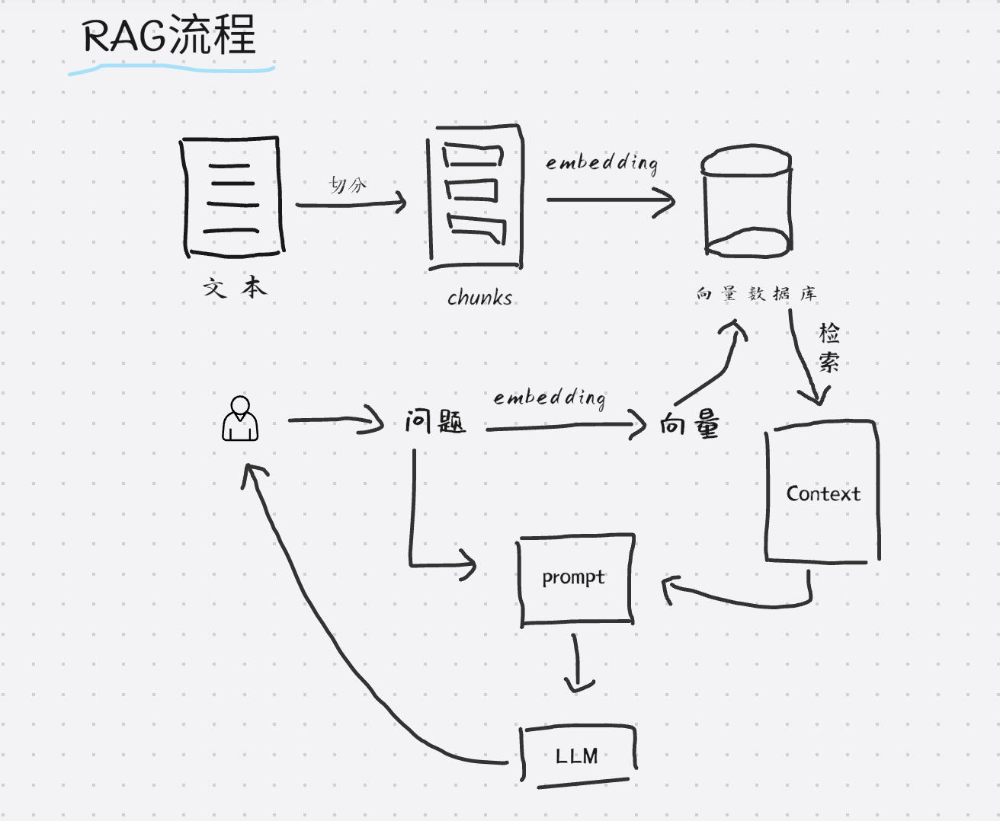

# RAG工作流

::: tip 说明
  对于大模型来讲，目前最常用的一个方法论就是RAG,通过RAG我们可以吧一些企业知识，一些私有化的知识库跟大模型融合在一起，来解决一些用户问题。
:::

## 核心

RAG的核心是：知识库

## 流程

1. 需要一些文本，大量的文本其实是构建了我们的知识库
2. 为了检索加速的效率，我们会让文本通过“切分”之后存储的向量数据库中去
3. 在用户提问阶段，先提问，问题通过一个embbeding工具转换成一个向量，然后这个向量会去向量数据库中检索，检索到最相似的文本
4. 检索出来的结果我们以Context表示，基于这个Context和用户的问题结合成一个prompt
5. 最后把生成的prompt去给大模型处理并返回结果给用户