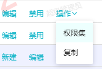
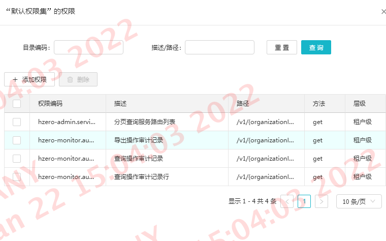
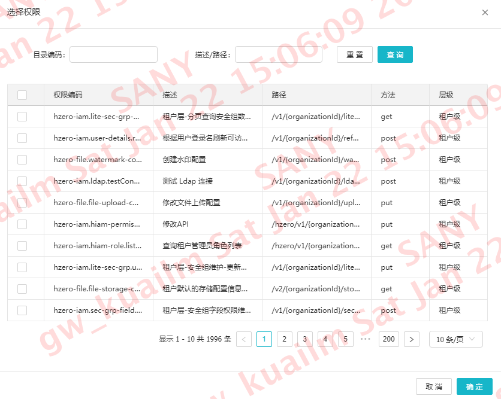

# 接口权限配置

::: tip 说明
  汉得提供了一套接口权限配置方案，此方案根据菜单维度来分配！
:::

### 准备工作

1. 首先我们用超级管理员账户登录
2. 打开角色管理，路径：系统管理 -> 角色管理 -> 角色管理

   打开菜单管理：路径：系统管理 -> 菜单管理 -> 菜单管理

### 第一步：添加接口权限项

首先进入菜单管理，选择租户层的菜单数据

每个菜单后面都有操作项，其中有一个权限集的操作：如下图

进入权限集的页面如下图:

右上角会看到一个“新建”按钮，点击新建

有3个参数让你编辑
1. “权限集编码”：当你打开权限集的时候，就已经有一条“默认权限集”的数据，这条数据中的权限集编码可以直接复制到新建的地方，把最后一位替换掉新的自定义命名
2. “权限集名称”：自定义
3. “序号”： 接口数据的排序号

在填写“权限集名称”的时候，需要支持国际化

填好之后点击保存就会创建一个新的权限
### 第二步：接口权限绑定

进入角色管理，找到对应的角色的权限分配，如下图：

点击分配权限会展示，如下图：

在这里会看到上面刚创建的权限配置，只不过默认是“未选择”状态，只有勾选了这个账户对应的接口权限才能形成链接。

### 第三步：接口权限与真实接口绑定

进入“菜单配置”，从菜单操作项中点击“权限集”

1. 在每个“权限类型”为 API的操作项中，点击“权限”的操作

2. 点击“添加权限”

在这里通过“描述/路径”搜索对应的后端接口，前提是后端API已经成功发布当前的配置环境，点击确定后就成功把真实API绑定到权限集