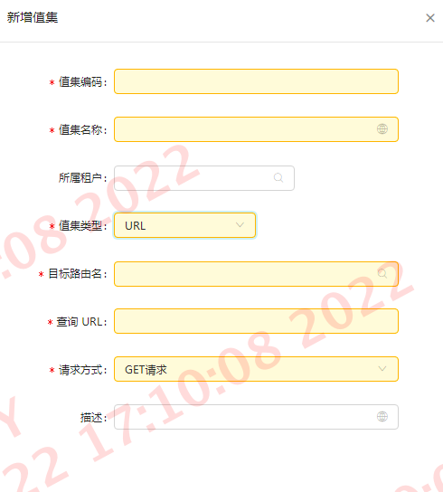

# LOV 组件

::: tip 说明
  记录汉得LOV组件库的使用方式
:::

### 值集配置
LOV组件的数据来源是来自值集配置

在值集配置中分为 1. 后端数据 2. 自定义数据 这二种

路径：开发管理 -> 值集管理 -> 值集配置    界面如下：


值集类型： 
   1. 独立值集
   2. 自定义sql
   3. URL


具体参考[官方文档](https://open.hand-china.com/document-center/doc/component/163/15280?doc_id=128462&doc_code=29022#1.%E7%8B%AC%E7%AB%8B%E5%80%BC%E9%9B%86)

### 新建值集
点击右上角的“新建”按钮


在新增过程中，我们选择值集类型基本为“URL”,这个时候会多出一些必填参数：



1. 目路由名：这里根据后端服务名来定，比如：调用接口来自“idea-basedata”,则目路由名idea-basedata
2. 查询URL：后端接口地址
3. 请求方式：接口网络请求的方法
4. 值集编码：为了防止编码定义冲突，需要定义一个公式：“接口服务名” + “.” + “接口名” （BUSICONFIG.PRODUCTTYPE_QUERYBYSTATUS）
<font color=red face="黑体">注：接口名层级会很多，已下划线分割。整个值集编码全大写,尽量少精简命名</font>

上面信息填写好保存即可完成值集的创建

### 使用值集

```JS {8}
ds = new DataSet({
    primaryKey: 'code',
    autoCreate: true,
    fields: [
      {
        name: 'code',
        type: 'object',
        lovCode: 'LOV_MOCK_CODE',
        multiple: true,
        required: true,
      },
    ],
    cacheSelection: true,
    selection: 'multiple',
    events: {
      update: handleDataSetChange,
    },
});
```

根据官方给出的代码实例，其中有一个参数“lovCode”，这个就是把创建的值集和组件做绑定