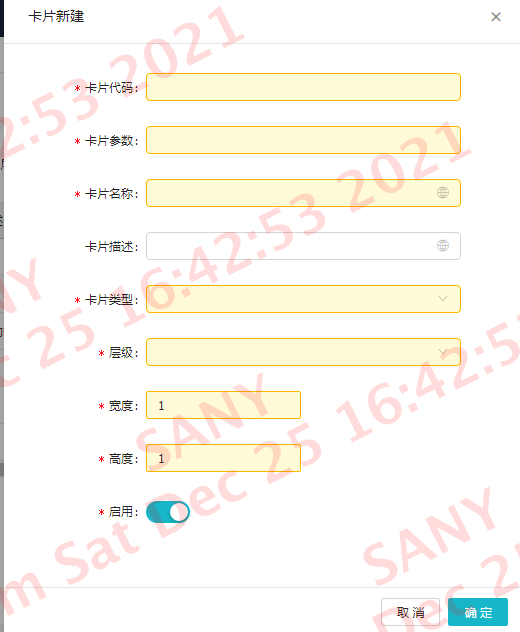
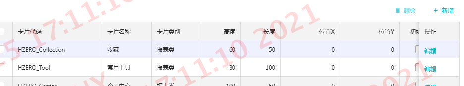
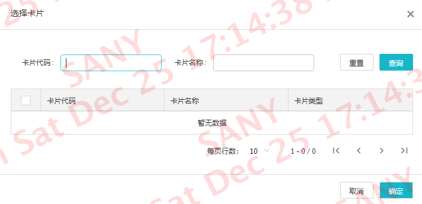

# 工作台

::: tip 说明
 这里首先要吐槽一下，汉德的前端技术文档写得让人理解很费劲，其技术文档写的很片面，具体流程几乎没有讲清楚。我们在开发过程中，不停的去找答案！一个字“坑”，接下来记录工作台开发的流程。
:::

### 第一步：配置新的工作台卡片

首先用超级管理员账户登录，找到菜单“卡片管理”，点击进入


然后“新建”一个卡片




按照要求把下面的内容填好，并保存成功即可，这里抽取重要字段说明一下：

1. 卡片代码：这个定义是在程序中使用的，定义格式: 'HZERO' + '_' + 自定义代码
2. 卡片类型：默认提供三种“待办类”，“报表类”，“通知类”，我们做表格展示一般选择“报表类”
3. 宽度、高度： 这个初始化卡片展示范围的属性

新创建的卡片需要配置到对应角色下去使用，所以要进入“角色管理”里去分配权限,如图：


在这里我们看到一个“工作台配置”，点击进入


在这里展示的数据都是这个角色可以使用的卡片，如果有新的，就点击右上角的“新增”按钮




通过“卡片代码”进行搜索，并选择新创建的卡片！这样就把卡片绑定到对应的账号上了。

### 第二步 代码编写

在汉德前端工程体系里面都会有一个customize文件夹，其功能是“跨模块方式”开发，通过这样方式开发

文件夹目录结构
```JS
/customize
└── index.js 
```

1. 首先创建卡片与页面之间的关联：如下

```JS
import { setCard } from 'hzero-front/lib/customize/cards';
// 个人中心
setCard({
    code: 'HZERO_Center',
    component: () => import('../pages/workplace/center')
    });
```

通过setCard把卡片与页面对应在一起。

<font color=red face="黑体">注：这里component的组件引用，必须按照上面例子去编写，不然会出现组件无法发起网络请求的现象！</font>

