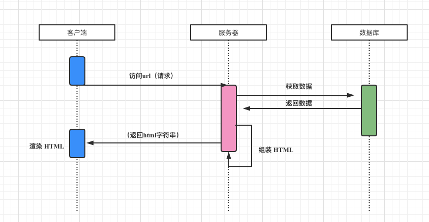
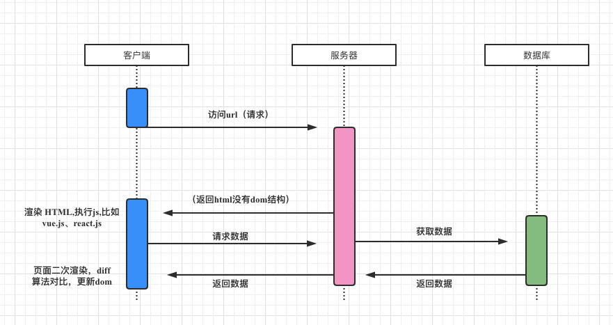

# SSR服务端渲染

::: tip 说明
  要做服务端渲染，就必然需要一个实时在线的后台服务（通常是基于 Node.js 的服务）用来承载页面请求，那么：

  1、需要服务器的计算资源和公网流量来部署这套服务，并且消耗的资源与页面的访问量成正相关，当页面的访问量突增时，渲染服务也需要进行扩容；

  2、服务端只能部署在有限的几个地域，对于距离服务端较远的用户而言，加载速度跟静态资源的 CDN 相比，慢了一个数量级（通常是 1-5ms VS 50-100+ms）；

  3、日常也存在传统服务端同样的运维、监控告警等方面的负担，团队需要额外的人力来开发和维护。

:::
## 第一种 （传统web）
传统web开发，网页内容在服务端渲染完成，一次性传输到浏览器.比如（jsp，java体系的动态模版等等...）

## 第二种 （单页面应用）
单页应用优秀的用户体验，使其逐渐成为主流，页面内容由JS渲染出来，这种方式称为客户端渲染。弊端SEO不好

## 第三种 （服务器渲染）
前端利用node.js体系，结合vue做SSR，比如最近刚开源的Midway.js方案, 在服务器端先把vue模版和数据拼接完成，然后输出html字符串给浏览器，浏览器接收到这个"HTML"文档,然后浏览器引擎开始解析 js,css,html，最终把页面呈现出来，其原理一样达到服务器最初的渲染机制，SEO没有影响

