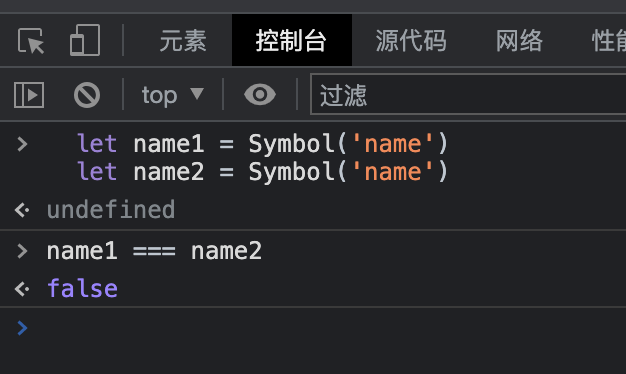

# symbol
::: tip 介绍
  symbol是一个ES6标准种新增的一种基本数据类型，在JavaScript中，共有七种基本数据类型：string、number、object、boolean、null、undefined、symbol。并且除了null和undefined之外，每个基本类型都有其包装对象。

  symbol是通过Symbol()函数生成，每一个symbol都是唯一的。现在对象属性名分为了以下两种：一种就是原本的字符串类型，一种就是symbol类型
:::

基本用法:
```js
  let name = Symbol('name')
```

唯一性效果:
```js
  let name1 = Symbol('name')
  let name2 = Symbol('name')

```
输出结果：




Symbol 数据类型的另一特点是隐藏性，for···in，object.keys() 不能访问
```js
  let name = Symbol('name')

  let obj = {
    [name]:'symbol'
  }

  for(let option in obj){
     console.log(obj[option]);
  }

```
输出结果：


JavaScript中大多数的数值都支持隐式转换为字符串，但symbol不会转换，可以手动将 symbol 转换成字符串：

```js
  let name = Symbol('name')
  alter(name)  // TypeError: Cannot convert a Symbol value to a string

  alert(name.toString())

```

 symbol 也不能与其他类型的值进行运算

 ```js
  console.log('symbol is' + name); // TypeError: Cannot convert a Symbol value to a string

```

Symbol.for() 

如果我们要重复使用一个 symbol 时，可以用到 Symbol.for() 方法。Symbol.for() 方法接受一个字符串参数，会在全局中搜索有没有以该参数命名的 symbol 的值，如果查找到就返回这个值。如果没有查到则重新生成一个值，并将该值以参数名称注册到全局。

 ```js
  let klm1 = Symbol.for('klm'); // 创建
  let klm2 = Symbol.for('klm'); // 查找
  
  klm1 === klm2; // true

```

Symbol.keyFor() 

方法表示获取一个 symbol 的值在全局中注册的命名参数 key，只有使用 Symbol.for() 创建的值才会有注册的命名参数，使用 Symbol() 生成的值则没有：


 ```js
 let s4 = Symbol('sq');
let s5 = Symbol.for('sq');
Symbol.keyFor(s4); // undefined
Symbol.keyFor(s5); // sq

```