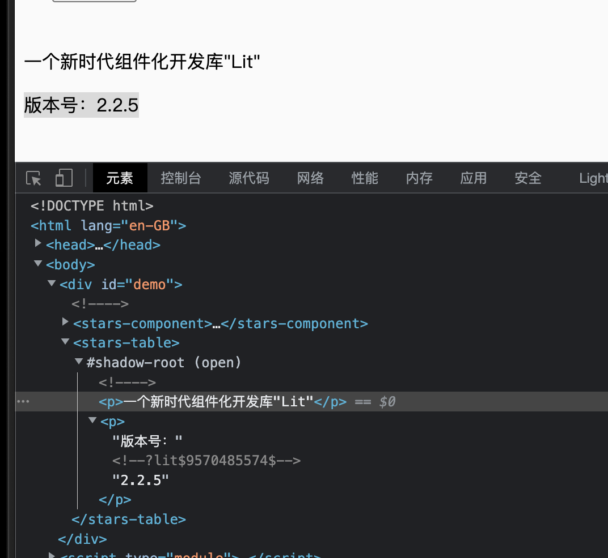

# Demo
```js
import { LitElement,html } from 'lit';
import { customElement, property } from 'lit/decorators.js';

@customElement('stars-table')
export class StarsTable extends LitElement{
    @property({type: String}) version =  '2.2.5'

    render(){
        return html`
          <p>一个新时代组件化开发库"Lit"</p>
          <p>版本号：${this.version}</p>
       `
    }
}
```

最终显示：

