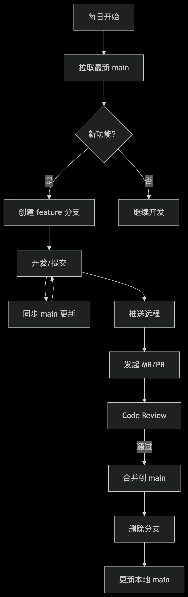

<!--
 * @Author: 蒯灵敏
 * @Date: 2025-06-12 14:18:56
 * @LastEditors: 蒯灵敏
 * @LastEditTime: 2025-06-13 09:36:24
 * @Description: 文件描述
 * @FilePath: /stars-vuepress/docs/standard/git.md
-->
# git规范


### 分支命名规范

1. master 主分支
   用于部署生产环境的分支，一般由test分支经过测试完整测试之后合并到主分支

2. test 测试分支
   专门用户测试产品使用的分支,测试完全通过合并到master分支

3. develop 开发分支
   一般开发的新功能时，feature分支都是基于develop分支下创建的，需要始终保持最新完成以及bug修复后的代码，然后提交给test分支进行测试

4. feature 新功能分支（一般简写为feat）
   开发新功能时，以develop为基础创建feature分支。 命名规则:feat/你的名称_模块_功能_时间

5. hotfix 修复分支（一般简写为fix）
   修复上线紧急问题，需要及时修复，这个是以master分支为基础来创建分支，修复完成之后需要合并到develop、test、master分支 命名规则: fix/你的名称_模块_功能_时间


### 开发规范

#### 一、拉取代码
操作流程：
 ```js
  # 1. 切换到主分支（master）
    git checkout master

  # 2. 拉取远程最新代码（推荐 rebase 模式）
    git pull --rebase origin main

  # 3. 若存在本地未提交修改，先暂存：
    git stash
    git pull --rebase origin main
    git stash pop  # 还原修改
 ```

 #### 二、创建新功能分支
操作目的：隔离开发环境，避免污染主分支
规范：
   - 分支命名：feat/你的名称_模块_功能_时间（例：feat/klm-activity-order-20250612）
   - 分支必须从最新 master 创建
 ```js
  # 1. 确保主分支最新（参考第一步）
  # 2. 创建并切换分支
  git checkout -b feat/klm-activity-order-20250612
 ```

 #### 三、开发过程中的操作规范
 
 1. 提交代码到本地仓库

 ```js
  # 一定要拉取最新代码，方式合并冲突
  git pull

  # 添加修改（禁止全目录提交）
  git add src/components/LoginForm.vue

  # 信息需清晰
  git commit -m "feat(login): 实现邮箱登录表单验证"

  # 提交
  git push

 ```

提交信息规范：

前缀：feat(模块): / fix(模块): / docs: / style: / refactor:
内容：动词开头（添加/修复/优化...）+ 具体描述


2. 合并主分支更新（长期开发时）

```js
   # 1. 提交本地所有修改（commit 或 stash）
   # 2. 获取主分支最新代码
        git fetch origin master

   # 3. 变基到最新 main（推荐）
        git rebase origin/master

   # 4. 解决冲突（若有）
        git add [冲突文件]
        git rebase --continue

 ```

 #### 三、其他操作

1. 删除本地分支

 ```js
  git checkout main
  git branch -d feat/klm-activity-order-20250612  # 普通删除
  git branch -D feat/klm-activity-order-20250612  # 强制删除（未合并时）
 ```

2. 删除远程分支

 ```js
  git push origin --delete feat/klm-activity-order-20250612
 ```

2. 更新本地分支

 ```js
  git checkout main
  git pull --rebase origin main
 ```
 
 3. 紧急修复（Hotfix）规范

 ```js
  # 从主分支创建 hotfix 分支
    git checkout -b hotfix/klm-activity-order-20250612 master

  # 修复后合并到 master 和 develop,test 分支
    git checkout master
    git merge --no-ff hotfix/klm-activity-order-20250612
 ```


操作流程图：

 