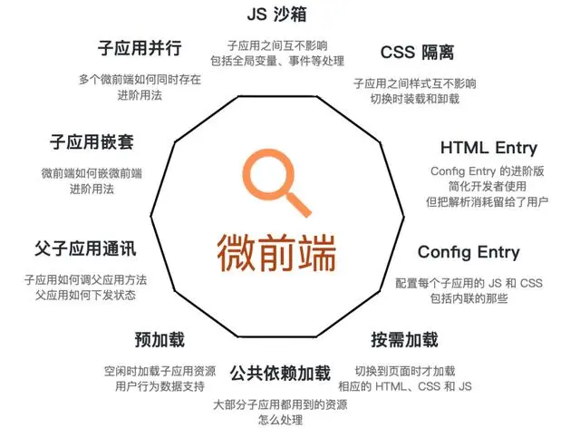

# 微前端架构分析

::: tip 说明
   微前端，是将单体化的前端系统拆分成多个小型的前端应用，在同一个页面上协同工作。换言之，微前端是一种前端架构模式，通过拆分前端系统为独立的微前端应用来解决大型应用的复杂性问题。
:::

### 为什么要用微前端

1. 独立开发：每个团队负责自己的微前端应用，独立开发、技术栈不受限制。
2. 独立部署：每个微前端应用都可以独立部署，实现独立模块更新且不会影响到主体
3. 独立测试：每个微前端应用都可以独立测试，可以快速发现问题
4. 独立迭代：每个微前端应用都可以独立迭代，不影响主体，提升系统可维护性和升级效率

### 微前端实现方式

1. web components: 是一系列原生的API, 用于创建自定义元素，这些元素可以像原生HTML标签一样使用。
2. iFrame: 是 HTML 中用于嵌入其他网页的元素，利用 iFrame 可以将微前端应用作为 iFrame 的应用载入到页面中。这种方式实现简单，但需要解决 iFrame 与主应用之间的通信问题。
3. 路由切换: 路由切换的方式实现微前端，通过路由切换的方式将微应用切换到页面中。这种方式实现简单，易于扩展

###  微前端核心

### 微前端架构对比

### 浏览器组件特性介绍

在浏览器端对组件的技术实现上，Custom Element、 HTML Templates HTML Modules 和 Shadow DOM.

如下图对几大浏览器厂商的兼容对比：

总结： 根据上图分析，选择京东的Micro App 架构，它借鉴了WebComponent的思想，通过js沙箱、样式隔离、元素隔离、路由隔离模拟实现了ShadowDom的隔离特性，并结合CustomElement将微前端封装成一个类WebComponent组件，从而实现微前端的组件化渲染，旨在降低上手难度、提升工作效率。